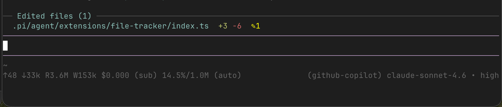

# pi-file-tracker

A persistent widget for the [pi coding agent](https://pi.dev) that sits above the text input and lists every file the agent has edited during the session, updated in real time after each change.



## Install

```
pi install npm:pi-file-tracker
```

Activates automatically — no configuration needed. Run `/reload` if pi is already open.

## What it shows

```
── Edited files (3) ────────────────────────────────────
  src/app.ts              +42 -7   ✎3
  src/utils/helpers.ts    +15      ✎1
  config/settings.json ✦  +8  -2   ✎2
```

| Element | Meaning |
|---------|---------|
| `+N` (green) | Lines added across all edits to that file |
| `-N` (red) | Lines removed |
| `✎N` (yellow) | Number of separate edit/write operations |
| `✦` (green) | File was created new during this session |

The widget appears as soon as the first file is edited and updates after every `edit` or `write` tool call.

## How stats are computed

- **`edit` tool** — parses the unified diff from pi's `EditToolDetails`, so counts are exact per-edit.
- **`write` tool** — reads the old file content before the write executes, then runs a real LCS-based line diff against the new content. Writing a new file counts all lines as additions.

## Commands

| Command | Effect |
|---------|--------|
| `/file-tracker` | Toggle the widget on/off |
| `/file-tracker chars` | Switch between line-count and character-count display |
| `/file-tracker clear` | Reset the tracked files list |

## Session persistence

State is saved to the session file after every edit via `pi.appendEntry`, so the file list survives restarts and session resumes. It is also branch-aware: navigating the session tree with `/tree` rebuilds the list from the active branch, so the widget always reflects only the files edited on the current conversation path.
